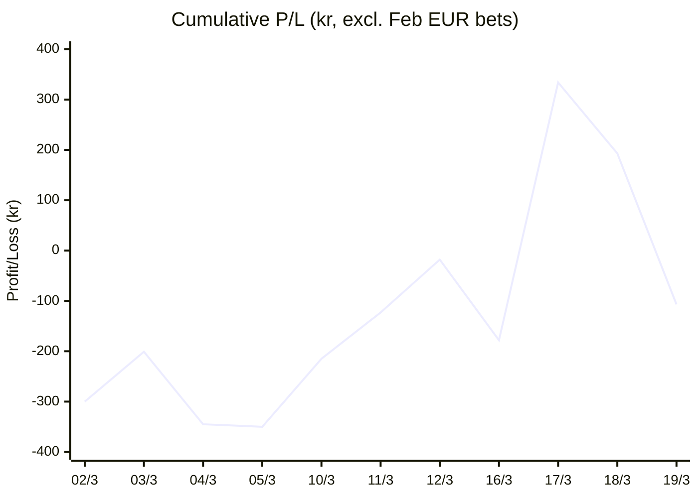

# 📈 Betting Results Tracker

## Cumulative Profit/Loss (kr)

---

| Date | Tournament | Combos | Result | Profit/Loss |
|---|---|---|---|---|
| 2026-03-19 | EL/ECL R16 2nd legs | 4 | 0/4 ❌ | -300 kr |
| 2026-03-18 | CL R16 2nd legs | 4 | 1/4 ❌ | -141 kr |
| 2026-03-17 | CL R16 2nd legs | 4 | 3/4 ✅ | ~+512 kr |
| 2026-03-16 | PL (single) | 1 | 0/1 ❌ | -160 kr |
| 2026-03-12 | EL R16 | 4 | 2/4 ✅ | ~+105 kr |
| 2026-03-11 | CL R16 | 4 | 2/4 ✅ | +92 kr |
| 2026-03-10 | CL R16 | 4 | 2/4 ✅ | ~+135 kr* |
| 2026-03-05 | PL (single) | 4 | 2/4 ✅ | ~-5 kr* (break even) |
| 2026-03-04 | PL | 4 | 1/4 ❌ | -144 kr |
| 2026-03-03 | PL + Copa del Rey | 4 | 2/4 ✅ | ~+99 kr* |
| 2026-03-02 | La Liga | 4 | 0/4 ❌ | -100% budget |
| 2026-02-26 | EL | 4 | 0/4 ❌ | -€30 |
| 2026-02-25 | CL | 5 | 3/5 ✅ | +~€26 |

*\* = estimated from typical odds (exact odds not recorded)*

---

**Running totals:** 50 bets | 18/50 wins (36.0%) | Net: ~-107 kr estimated (excl. Feb dates in €)
